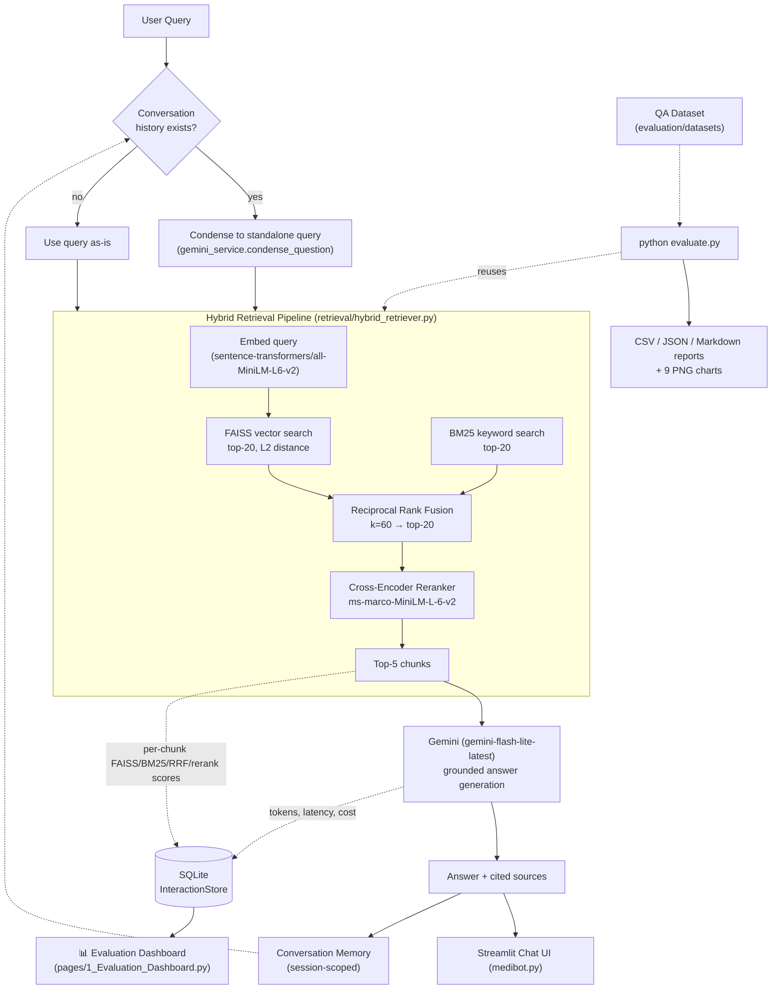
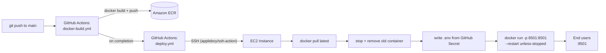

# 🩺 Medical RAG Chatbot

**A production-grade Retrieval-Augmented Generation (RAG) system** for medical question answering — hybrid retrieval (FAISS + BM25 + Reciprocal Rank Fusion + Cross-Encoder reranking), multi-turn conversation memory, full runtime observability, a live analytics dashboard, and an offline retrieval-quality evaluation framework, all shipped with Docker + CI/CD to AWS.


---

## Table of Contents

- [Project Overview](#project-overview)
- [Demo & Screenshots](#demo--screenshots)
- [Key Features](#key-features)
- [Architecture Diagram](#architecture-diagram)
- [Technology Stack](#technology-stack)
- [Project Structure](#project-structure)
- [Retrieval Pipeline](#retrieval-pipeline)
- [Conversation Memory](#conversation-memory)
- [Runtime Metrics](#runtime-metrics)
- [Evaluation Dashboard](#evaluation-dashboard)
- [Offline Evaluation Framework](#offline-evaluation-framework)
- [Deployment Architecture](#deployment-architecture)
- [Installation](#installation)
- [Docker Setup](#docker-setup)
- [AWS Deployment](#aws-deployment)
- [Environment Variables](#environment-variables)
- [Future Improvements](#future-improvements)
- [References](#references)
- [License](#license)
- [Author](#author)

---

## Project Overview

This project started as a simple "embed a PDF, search it, ask an LLM" chatbot and was rebuilt, piece by piece, into something closer to a **production RAG system** — the kind of retrieval architecture and observability tooling you'd actually want before putting a medical-information assistant in front of real users.

It answers questions against a real medical reference text (*The Gale Encyclopedia of Medicine*) using **only** retrieved context — never the LLM's own unguided knowledge — and is explicit about it: if the retrieved chunks don't support an answer, it says so instead of guessing.

What makes it "production-grade" rather than a weekend demo:

- **Hybrid retrieval** — dense (FAISS) and sparse (BM25) search fused with Reciprocal Rank Fusion and refined with a cross-encoder reranker, instead of relying on a single, brittle similarity search.
- **Real multi-turn memory** — follow-up questions like *"what are its symptoms?"* get resolved against conversation history before retrieval, not just stuffed into a prompt.
- **Full runtime observability** — every stage of every query (embedding, vector search, BM25, fusion, reranking, generation) is timed, and every interaction is persisted for analysis.
- **A live analytics dashboard** and an **offline evaluation CLI** with standard IR metrics (Precision@K, Recall@K, MRR, MAP, nDCG, ...) — the two things that separate "it works on my machine" from "we can measure whether it's actually good."
- **Real deployment infrastructure** — Dockerized, with a GitHub Actions pipeline that builds, pushes to Amazon ECR, and deploys to EC2 on every push to `main`.


## Key Features

**Retrieval**
- Hybrid dense + sparse retrieval: FAISS (semantic) + BM25 (keyword), fused with Reciprocal Rank Fusion
- Cross-encoder reranking (`cross-encoder/ms-marco-MiniLM-L-6-v2`) over the fused candidate pool
- Graceful degradation — if BM25 or the reranker fail to load, retrieval falls back to FAISS-only rather than crashing

**Conversation**
- Multi-turn memory scoped per browser session (not leaked across users)
- LLM-based query condensation resolves pronouns/references ("it", "its symptoms") into standalone queries before retrieval
- Grounded generation — the model is instructed to answer *only* from retrieved context and say so explicitly when it can't

**Observability**
- 12 runtime metrics per query (embedding, vector search, BM25, fusion, reranking, and generation time; token counts; context size; chunk counts)
- Every interaction — query, answer, full metric set, and per-chunk retrieval scores — persisted to SQLite
- A live, filterable, exportable analytics dashboard as a second Streamlit page
- An offline CLI evaluation framework with 10 standard information-retrieval metrics, auto-generated CSV/JSON/Markdown reports, and 9 chart types

**Engineering**
- Clean modular package layout (`retrieval/`, `memory/`, `metrics/`, `dashboard/`, `evaluation/`) — no framework does double duty
- Shared factory functions so the Streamlit app, CLI script, and evaluator all build the exact same retrieval stack — zero duplicated wiring logic
- Dockerized, with CI/CD to AWS via GitHub Actions

## Architecture Diagram



## Technology Stack

| Layer | Technology |
|---|---|
| UI / App framework | [Streamlit](https://streamlit.io/) (multipage app) |
| Orchestration | [LangChain](https://www.langchain.com/) (`langchain-core`, `langchain-community`, `langchain-huggingface`) |
| Dense retrieval | [FAISS](https://github.com/facebookresearch/faiss) (`faiss-cpu`) |
| Sparse retrieval | [rank_bm25](https://github.com/dorianbrown/rank_bm25) (BM25Okapi) |
| Reranking | [sentence-transformers](https://www.sbert.net/) CrossEncoder (`ms-marco-MiniLM-L-6-v2`) |
| Embeddings | `sentence-transformers/all-MiniLM-L6-v2` (HuggingFace) |
| Generation | Google [Gemini](https://ai.google.dev/) (`google-generativeai`) |
| Analytics storage | SQLite (stdlib `sqlite3`) |
| Data / charts | `pandas`, `plotly` (interactive dashboard charts), `matplotlib` (static evaluation reports) |
| Document ingestion | `pypdf`, `RecursiveCharacterTextSplitter` |
| Containerization | Docker |
| CI/CD | GitHub Actions → Amazon ECR → EC2 |
| Language / runtime | Python 3.13 |

## Project Structure

```text
medical-chatbot/
├── medibot.py                     # Main Streamlit chat app (entrypoint)
├── connect_memory_with_llm.py     # CLI companion script (single-shot query, no UI)
├── create_memory_for_llm.py       # Ingestion: PDF → chunks → FAISS + BM25 indices
├── gemini_service.py              # Prompting, query condensation, Gemini calls, token accounting
├── evaluate.py                    # CLI entrypoint for the offline evaluation pipeline
│
├── retrieval/                     # Hybrid retrieval pipeline
│   ├── config.py                  #   RetrievalConfig (top-k, RRF k, rerank-k, ...)
│   ├── bm25_index.py               #   BM25Index (build/save/load/search)
│   ├── fusion.py                  #   Reciprocal Rank Fusion
│   ├── reranker.py                #   CrossEncoderReranker
│   ├── hybrid_retriever.py        #   Orchestrates FAISS + BM25 → RRF → rerank
│   ├── loaders.py                 #   Shared factory functions (used by all 3 entrypoints)
│   └── models.py                  #   ChunkTrace (per-chunk score/rank record)
│
├── memory/                        # Conversation memory
│   └── conversation_memory.py     #   ConversationMemory (session-scoped chat history)
│
├── metrics/                       # Runtime metrics (framework-agnostic)
│   ├── models.py                  #   QueryMetrics dataclass
│   ├── timer.py                   #   Stopwatch context manager
│   └── token_estimator.py         #   Char-based token estimate (fallback only)
│
├── dashboard/                     # Production analytics
│   ├── storage/                   #   InteractionRecord + SQLite InteractionStore
│   ├── analytics/                 #   Session summary aggregation + cost estimator
│   └── charts/                    #   Plotly chart builders
│
├── pages/
│   └── 1_Evaluation_Dashboard.py  # Streamlit multipage: the analytics dashboard UI
│
├── evaluation/                    # Offline retrieval evaluation framework
│   ├── datasets/                  #   QAItem schema, JSON loader, sample dataset
│   ├── metrics/                   #   Precision@K, Recall@K, F1, MRR, MAP, nDCG, Coverage, ...
│   ├── evaluator/                 #   Evaluator - runs the dataset through the real pipeline
│   ├── reports/                   #   CSV / JSON / Markdown report writers
│   ├── plots/                     #   Matplotlib static chart generators
│   └── utils/                     #   Shared text-normalization helpers
│
├── data/                          # Source PDF(s) for ingestion
├── vectorstore/                   # Persisted FAISS index + BM25 index (generated)
├── tests/                         # Unit tests
├── docs/                          # Presentation deck / docs assets
│
├── Dockerfile
├── .github/workflows/
│   ├── docker-build.yml           # Build & push image to Amazon ECR on push to main
│   └── deploy.yml                 # Deploy latest image to EC2 via SSH
├── requirements.txt
├── Pipfile / Pipfile.lock
└── .env.example
```

## Retrieval Pipeline

```
User Query
    │
    ├─────────────────┐
    │                 │
FAISS Vector Search   BM25 Keyword Search
  (top-20, L2)          (top-20)
    │                 │
    └───────┬─────────┘
            │
  Reciprocal Rank Fusion (k=60 → top-20)
            │
   Cross-Encoder Reranker
   (ms-marco-MiniLM-L-6-v2)
            │
     Top-5 Chunks → Gemini
```

**Why hybrid, not just vector search?** Dense embeddings are great at semantic similarity but can miss exact terminology (drug names, precise clinical terms); BM25 is the opposite — great at exact term matches, blind to paraphrasing. Fusing both, then reranking with a cross-encoder that scores the *(query, chunk)* pair jointly (far more accurate than either retriever's standalone score, but too slow to run over the whole corpus), gets the precision of both approaches without the corpus-wide cost of cross-encoding everything.

All of this lives in `retrieval/hybrid_retriever.py`, tunable via `retrieval/config.py`'s `RetrievalConfig`:

| Parameter | Default | Meaning |
|---|---|---|
| `faiss_k` | 20 | FAISS candidates before fusion |
| `bm25_k` | 20 | BM25 candidates before fusion |
| `rrf_k` | 60 | RRF damping constant |
| `fusion_top_n` | 20 | Fused candidates passed to the reranker |
| `rerank_top_n` | 5 | Final chunks sent to Gemini |

Every retrieval call also records **why** each chunk was selected — its FAISS L2 distance, BM25 score, RRF score, and cross-encoder score — via `HybridRetriever.retrieve_with_trace()`, which is what powers the Evaluation Dashboard's per-query score breakdown and the offline evaluator's retrieval-score charts.

Both BM25 and the reranker are **optional** at runtime: if the BM25 index hasn't been built yet, or the cross-encoder fails to download, the pipeline logs a warning and falls back to a smaller pipeline (FAISS-only, or fused-but-unranked) instead of crashing the app.

## Conversation Memory

The chatbot supports real multi-turn conversations:

```
User: What is diabetes?
Bot:  Diabetes mellitus is a chronic disease in which the body cannot
      properly produce or respond to insulin...

User: What are its symptoms?
                 ↓ condensed before retrieval to:
      "What are the symptoms of diabetes?"
Bot:  Common symptoms include frequent urination, excessive thirst...

User: How is it treated?
                 ↓ condensed to:
      "How is diabetes treated?"
Bot:  Treatment includes changes in diet, oral medication...
```

- **`memory/conversation_memory.py`** — `ConversationMemory` wraps LangChain's `InMemoryChatMessageHistory` (the actively maintained primitive; the older `ConversationBufferMemory` was deprecated in LangChain 0.3.1). Capped at the last 6 turns so prompts don't grow unbounded over a long session.
- **Query condensation** — before retrieval, `gemini_service.condense_question()` rewrites a follow-up question into a standalone one using recent history, so the embedding/BM25 search sees the real topic instead of a bare pronoun. This is skipped entirely (no extra API call) on the first turn.
- **Session-scoped, not global** — memory lives in `st.session_state`, never in `st.cache_resource` (which is shared across every user of the deployed app), so one user's conversation never leaks into another's.
- **Grounding is preserved** — history is used only to resolve *what the user is referring to*; the final answer prompt explicitly instructs Gemini that history is not a source of medical facts, only retrieved context is.

## Runtime Metrics

Every query is instrumented end-to-end and shown in a **collapsible sidebar** on the chat page:

| Metric | What it measures |
|---|---|
| Embedding Time | Time to embed the query vector |
| Vector Search Time | FAISS similarity search time |
| BM25 Search Time | BM25 keyword search time |
| Fusion Time | Reciprocal Rank Fusion time |
| Reranking Time | Cross-encoder reranking time |
| LLM Generation Time | Gemini response generation time |
| Total Response Time | End-to-end time for the whole turn |
| Retrieved Documents Count | Fused candidate pool size before reranking |
| Final Context Chunks / Size | Chunks and characters actually sent to Gemini |
| Estimated Prompt Tokens | From Gemini's own `usage_metadata` when available, else a char-based estimate |
| Estimated Output Tokens | Same as above, for the generated answer |

These are collected once per query (`metrics/models.py::QueryMetrics`, `metrics/timer.py::Stopwatch`) and **reused everywhere downstream** — the sidebar, the SQLite interaction log, the analytics dashboard, and the offline evaluator all read the same numbers rather than recomputing them.

## Evaluation Dashboard

A second Streamlit page (`pages/1_Evaluation_Dashboard.py`) that turns every logged chatbot interaction into production analytics — completely separate from the chat page, built entirely from data the chatbot already produced.

**Session Analytics** — total queries, average/fastest/slowest response time, average retrieval time, average generation time, average prompt/completion tokens, average context size, average retrieved chunks, estimated total API cost.

**Retrieval Analytics** — pick any past query and see the exact per-chunk breakdown: rank, source document, page, FAISS score, BM25 score, RRF score, and reranker score.

**Visualizations** (interactive, Plotly) — response latency over time, retrieval score distribution, reranker score distribution, token usage over time, context size over time, top referenced documents, most frequently retrieved pages, response time histogram, query timeline.

**History** — a searchable, filterable (by text and latency range), sortable table of every interaction, with **CSV and JSON export**.

**How it's stored:** `dashboard/storage/interaction_store.py::InteractionStore` persists each turn to a local SQLite database (`dashboard/storage/data/interactions.db`) — `QueryMetrics` fields as flat columns (so aggregation is plain SQL/pandas), per-chunk scores as a JSON blob column. Logging happens as a best-effort side effect at the end of `medibot.py`'s chat loop and can never break the chat itself if it fails.

## Offline Evaluation Framework

Beyond live analytics, the project includes a standalone **retrieval quality evaluation CLI** — the kind of thing you'd run in CI or before/after a retrieval change to know, quantitatively, whether it helped.

```bash
python evaluate.py --dataset evaluation/datasets/sample_qa_dataset.json --k 5
```

It runs a labeled question set through the **exact same `HybridRetriever` and Gemini generation path the chatbot uses in production** (via `retrieval/loaders.py::build_hybrid_retriever`) — no retrieval logic is reimplemented for evaluation.

**Metrics computed** (`evaluation/metrics/retrieval_metrics.py`):

| Metric | | Metric |
|---|---|---|
| Precision@K | | Hit Rate |
| Recall@K | | nDCG@K |
| F1 Score | | Coverage |
| Mean Reciprocal Rank (MRR) | | Average Retrieval Time |
| Mean Average Precision (MAP) | | Average Generation Time |

Relevance is judged (`evaluation/metrics/relevance.py`) against a dataset of question / ground-truth-answer / relevant-document / relevant-chunk / expected-source entries (`evaluation/datasets/schema.py::QAItem`), matched via document, page-qualified source, or chunk-text overlap.

**Outputs**, written to `evaluation/reports/output/` and `evaluation/plots/output/` (git-ignored, regenerated per run):

- `per_question_report.csv` — one row per question
- `evaluation_report.json` — full report, including every per-chunk score
- `summary.md` — overall stats + per-question table, human-readable
- 9 PNG charts — precision / recall / F1 / MRR / nDCG distributions, latency distribution, retrieval score histogram (FAISS vs. BM25), an evaluation summary dashboard, and a retrieval-adapted confusion matrix

```bash
# Faster iteration: skip Gemini calls, score retrieval only
python evaluate.py --retrieval-only

# Evaluate your own dataset
python evaluate.py --dataset path/to/your_qa.json --k 10
```

## Deployment Architecture



- **`docker-build.yml`** — on every push to `main`: checks out the repo, authenticates to AWS, builds the Docker image, tags it, and pushes it to Amazon ECR.
- **`deploy.yml`** — triggered automatically when the build workflow completes successfully: SSHes into the target EC2 instance, logs in to ECR, pulls the freshly pushed image, stops/removes the old container, writes a fresh `.env` file from the `GEMINI_API_KEY` GitHub Secret, and starts the new container with `--restart unless-stopped`.

Required GitHub Secrets: `AWS_ACCESS_KEY_ID`, `AWS_SECRET_ACCESS_KEY`, `AWS_REGION`, `ECR_REPOSITORY`, `EC2_HOST`, `EC2_USERNAME`, `EC2_SSH_KEY`, `GEMINI_API_KEY`.

## Installation

### 1. Clone the repository

```bash
git clone https://github.com/sathvik-kandimala-2003/medical-chatbot.git
cd medical-chatbot
```

### 2. Create an environment and install dependencies

Using `venv` + `pip`:

```bash
python -m venv venv
# Windows: venv\Scripts\activate | macOS/Linux: source venv/bin/activate
pip install -r requirements.txt
```

Or using Pipenv:

```bash
pipenv install
pipenv shell
```

### 3. Configure environment variables

```bash
cp .env.example .env
# then edit .env and add your GEMINI_API_KEY (and HF_TOKEN if needed)
```

### 4. Build the vector store (one-time ingestion)

Drop your source PDF(s) into `data/`, then:

```bash
python create_memory_for_llm.py
```

This chunks the PDF(s), builds the FAISS index, and builds the BM25 index — both saved under `vectorstore/`.

### 5. Run the app

```bash
streamlit run medibot.py
```

Open `http://localhost:8501`. The Evaluation Dashboard is automatically available in the sidebar navigation as a second page.

### 6. (Optional) Run the offline evaluator

```bash
python evaluate.py
```

## Docker Setup

### Build the image

```bash
docker build -t medical-chatbot .
```

### Run the container

```bash
docker run -p 8501:8501 --env-file .env medical-chatbot
```

Then open `http://localhost:8501`.

The image is based on `python:3.11-slim`, installs a CPU-only PyTorch build explicitly (smaller image, no CUDA dependency) before the rest of `requirements.txt`, and disables HuggingFace symlinks/progress bars/tqdm noise for clean container logs.

## AWS Deployment

Deployment is fully automated via the two GitHub Actions workflows described in [Deployment Architecture](#deployment-architecture):

1. Push to `main`.
2. `docker-build.yml` builds the image and pushes it to Amazon ECR (`ap-south-1`).
3. On success, `deploy.yml` fires automatically, SSHes into the configured EC2 host, pulls the new image, and restarts the container with the latest code — zero manual steps.

To set this up for your own fork: create an ECR repository, an EC2 instance with Docker installed, and populate the GitHub Secrets listed above.

## Environment Variables

| Variable | Required | Description |
|---|---|---|
| `GEMINI_API_KEY` | Yes | API key for Google Gemini (answer generation, query condensation) |
| `HF_TOKEN` | No | HuggingFace token — raises rate limits for model downloads; not required for the public models this project uses |
| `LOG_LEVEL` | No | Python logging level (`ERROR` by default in `medibot.py`; `INFO` by default in the CLI scripts) — set to `DEBUG` to see per-stage retrieval timings in the logs |

See `.env.example` for a template.

## Future Improvements

- Support multiple source documents / a proper document-management ingestion flow (upload PDFs from the UI)
- Swap the char-based token estimate fallback for a real Gemini tokenizer when offline counting is needed
- Add authentication and per-user rate limiting for a real multi-tenant deployment
- Add a lightweight relevance-judgment UI to grow the offline evaluation dataset from real user queries
- Track evaluation runs over time (regression detection: did the last retrieval change help or hurt?)
- Move the interaction store from SQLite to a managed database for true multi-instance deployments (the current EC2 setup runs a single container)
- Add automated CI tests that run `evaluate.py` on every PR and fail on metric regressions

## References

- [Reciprocal Rank Fusion (Cormack et al., 2009)](https://plg.uwaterloo.ca/~gvcormac/cormacksigir09-rrf.pdf) — the fusion method used to combine FAISS and BM25 rankings
- [Robertson & Zaragoza — The Probabilistic Relevance Framework: BM25 and Beyond](https://www.staff.city.ac.uk/~sbrp622/papers/foundations_bm25_review.pdf)
- [Sentence-Transformers Cross-Encoders](https://www.sbert.net/examples/applications/cross-encoder/README.html)
- [LangChain Documentation](https://python.langchain.com/)
- [FAISS: A Library for Efficient Similarity Search](https://github.com/facebookresearch/faiss)
- [Google Gemini API Documentation](https://ai.google.dev/gemini-api/docs)
- [Streamlit Multipage Apps](https://docs.streamlit.io/develop/concepts/multipage-apps)

## License

This project is licensed under the [MIT License](LICENSE).

## Author

**Sathvik Kandimala**
GitHub: [@sathvik-kandimala-2003](https://github.com/sathvik-kandimala-2003)
